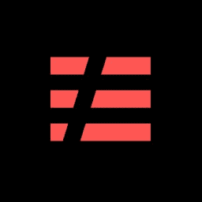
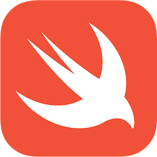

**[ChargedUp](https://chargedup.green)** is the UK’s first and fastest growing phone charging network, comprising of over 1000 stations enabling users to charge their phones on the go, 100K and counting. We are backed by **[JamJar](http://www.jamjarinvestments.com)** (Innocent Smoothie founders), **[The Garage Soho](https://www.thegaragesoho.london)** (Tom Teichman and Sir John Hegarty), **[Founders Factory](https://foundersfactory.com)** (Brent Hoberman of last minute.com and MADE.com) and more of London's top investors. We also have a partnership with **O2,** giving all of their customers free charge across the UK. Alongside our network, ChargedUp works with the largest brands and venues and is expanding **internationally**. 

Our tech team uses Scrum-ban, balancing planned product-led sprints with ad hoc efforts, including brand partnerships and growth marketing campaigns. Despite complexity behind the scenes, the goal is to ensure an easy rental — not a novelty, but a utility users can rely on. We strive to think ahead and future-proof, driving a scalable, accessible, end-to-end experience as we internationalize. It’s an exciting time to join; we’re scaling our network quickly and need our tech to not just keep up but rather lead the way in enabling opportunities. We hire self-motivated, proactive, energetic people; we’re less about hitting targets and more about truly solving a user’s need. If you’re passionate about serverless platforms, problem-solving, writing code you’re proud of and having a little fun along the way, let’s talk.

Currently high priority open positions in the tech team:

- [IOS Engineer](ios-engineer.md)
- [FullStack Engineer](fullstack-engineer.md)

Contact us if you are interested working as, we are always keen meeting interesting candidates:

- [Backend Engineer](backend-engineer.md)
- [Data Engineer](data-engineer.md)
- [Infrastructure Engineer](infrastracture-engineer.md)
- [Android Engineer](android-engineer.md)

|                                                               |                                                                    |                                                          |
| :-----------------------------------------------------------: | :----------------------------------------------------------------: | :------------------------------------------------------: |
| {:height="25%" width="25%"} |         {:height="25%" width="25%"}          |  {:height="25%" width="25%"}  |
|  {:height="25%" width="25%"}  |      {:height="25%" width="25%"}       | {:height="25%" width="25%"} |
|    {:height="25%" width="25%"}     | {:height="25%" width="25%"} |  {:height="25%" width="25%"}   |

